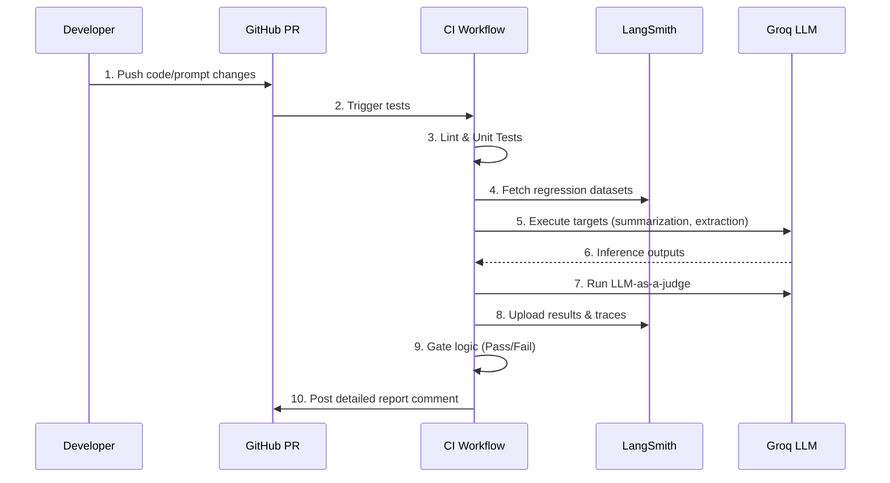

# CI-Gated LLM Pipeline

A production-ready FastAPI application wrapping LLM interactions, rigorously gated by a continuous integration pipeline. This system leverages LangSmith for trace observability and LLM-as-a-judge regression testing.

## Architecture & CI Gate Flow

The core design principle is that **no prompt or code change reaches production if it degrades LLM performance**. We enforce this using a rigorous GitHub Actions pipeline.



## Features

- **FastAPI Backend**: Robust API with `/invoke/{prompt_name}` endpoints.
- **Model Agnostic**: Defaults to `qwen/qwen3.8-27b` via Groq for high-speed, cost-effective inference.
- **Strict Prompt Registry**: File-based prompt versioning (`prompts/{name}/{version}.json`).
- **LangSmith Tracing**: Automatic tracing with metadata injection (`environment`, `prompt_name`, `prompt_version`, `ls_model_name`).
- **Continuous Evaluation**: 
  - **JSON Schema Validity**: Deterministic evaluation of structured output.
  - **Summary Length Bounds**: Deterministic word-count validation.
  - **LLM-as-a-Judge**: Evaluates summary relevance and conciseness against strict 1-5 rubrics.
  - **Entity Match F1**: Informational metric scoring precision/recall against target annotations.
- **Quality Gate**: Fails CI if JSON schema validity drops below 95% or if LLM judge quality drops below 4.0.

## Local Development

### Requirements
- Python 3.11+
- Docker & Docker Compose
- Groq API Key
- LangSmith API Key

### Setup
1. Clone the repository and set up a virtual environment:
   ```bash
   python -m venv .venv
   source .venv/bin/activate
   pip install -r requirements.txt -r requirements-dev.txt
   ```
2. Copy `.env.example` to `.env` and fill in your keys.
3. Seed the evaluation datasets into LangSmith:
   ```bash
   python scripts/seed_datasets.py
   ```
4. Run the local dev server:
   ```bash
   uvicorn app.main:app --reload
   ```

### Running the Regression Locally
```bash
python -m evaluation.run_regression --output-dir results
```

## Deployment

The application is containerized and ready for production deployment.
```bash
docker-compose up -d --build
```
A health check is built into the container to ensure the API is fully responsive before routing traffic.
